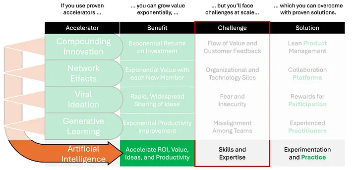

# Artificial Intelligence

It’s an understatement to say AI is hard to wrap your arms around. The scope of AI and its potential impact on humanity is vast. It’s easier to list things AI doesn’t impact than things it does. Not surprisingly then, AI in the context of this series is an accelerator of the other four accelerators.

It is possible to implement the other four accelerators we’ve discussed without AI. But — *WHY???* Unless there are ethical reasons (very likely in fact) or regulatory reasons (probably not yet), AI is likely to exponentially boost the others’ already-exponential benefits.

(For now at least) AI is a tool that, by definition, enhances and/or augments human productivity. It does that specifically by shortening the cycle time people (and teams, and teams-of-teams) need to learn something.

The way this works is people need to learn something that would be very time consuming (or impossible) to learn themselves, so they train an AI to learn it instead (or use an already-trained AI), then the people use the AI.

From this it’s immediately obvious how AI boosts the other four exponential accelerators. With greater knowledge at a given point in time, innovation is faster and more effective, networks are more valuable, good ideas originate and get routed through networks more quickly, and teams-of-teams learn more faster.

What’s less obvious is how AI itself helps boost the other accelerators *exponentially*. This has to do with the fact that AI is trained in multiple learning cycles, and so AI learning is a form of compounding in the same way as individual person, team, and team-of-team learning.

AI productivity is a function of its initial knowledge. When AI learns it acquires new knowledge which enhances its productivity. Each AI learning cycle increases its productivity. AI learning cycles are typically much shorter than human learning cycles, and shorter cycles increase the rate of compounding, accelerating productivity improvements *exponentially*.

The key challenge enterprises have in tapping into AI’s full potential is the scarcity of AI skills and expertise, and AI itself is not yet capable of filling this gap. The solution for now is [Gene Kim’s](https://medium.com/u/68ca219afa64) Third Way of Devops, which is creating a Culture of Continuous Learning and Experimentation. Because AI has the potential to help literally everyone, it is in every enterprise’s interests to help everyone learn to use AI to help themselves.

For some this means learning prompts that yield the most helpful answers from Generative AI applications such as ChatGPT4. For others, this means encouraging education about AI and Machine Learning (ML) so they can interact productively with data scientists and their teams. For many, it means experimenting with AI/ML tools, models, and data available via open source or proprietary to their organization.

Finally, enterprises should implement the other four exponential accelerators, if only because doing so will accelerate their ability to use AI (which of course means boosting the other accelerators!). Startup Lean Product Management to ignite Compounding Innovation around AI, deploy a Collaboration Platform to create Network Effects around an AI innovation community, Reward Participation in Viral Ideation within that community, and Train Practitioners to Align Teams and ignite Agile Team-of-Teams Learning about AI.

We’ll go deeper with examples around implementing AI as an exponential accelerator at scale in subsequent stories.