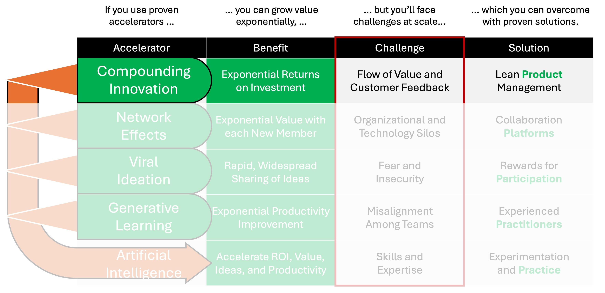

# Compounding Information Overview

Anyone fortunate enough to be able to invest a little money in a savings account understands the value of compounding interest over many days, months, or even years. Substituting an individual investor with an enterprise and a savings account with an investment in innovation over many months, quarters, or years may yield exponential returns on that investment due to compounding innovation.

OpenAI ChatGPT4’s AI summarized compounding innovation in this way:
- **Rationale**: Continuous reinvestment of returns fuels further growth by compounding improvements and innovations over time, enabling the scaling of operations and revenues.
- **Mathematical Basis**: Compound growth formula, \\(A = P(1 + r)^n\\), where the gains from one period serve as the principal for the next, leading to exponential growth.

Of course realizing exponential returns from investments in innovation at scale is MUCH riskier than investments in a savings account. Gene Kim, bestselling author of seminal works such as The Phoenix Project, boils the challenge down to implementing the Three Ways of DevOps: maximizing the FLOW of value from innovators to customers using system thinking, amplifying FEEDBACK loops from customers to innovators, and having a culture of continuous learning and experimentation. Gene reiterated these points in a slideshare titled “[Why Everyone Needs DevOps Now](https://www.slideshare.net/Dynatrace/why-everyone-needs-devops-now-gene-kim)”.

So if every enterprise’s challenge to getting exponential returns from compounding innovation at scale boils down to FLOW of value and customer FEEDBACK, then every enterprise needs an effective process to maximize flow and feedback. Historically innovation, which by definition produces change, was managed through projects, which by definition implement the change from a start point to an end point.

However innovation doesn’t have an end point. Enterprises must continuously [“innovate or die” according to Peter Drucker](https://drucker.institute/thedx/innovate-or-die/). A paradigm shift away from project-based innovation began at the dawn of the new millennium with the [Agile Manifesto](https://agilemanifesto.org/), continued through the 2010’s with the DevOps movement, and has now culminated in a new product-based paradigm.

This author was present recently when a Gartner executive asked a Fortune 500 IT services CIO what their top priority was, and his response was simply “Project-to-Product”. This phrase is the name used in the industry for this new product-based paradigm, reinforced by [Mik Kersten](https://medium.com/u/d532808bfc30) who wrote a bestselling book titled [Project to Product: How to Survive and Thrive in the Age of Digital Disruption with the Flow Framework](https://flowframework.org/ffc-project-to-product-book/).

So the solution for overcoming the challenge of FLOW and FEEDBACK at scale is effective Product Management. This has proven difficult for many enterprises accustomed to producing goods such as software products. It is exceptionally difficult for enterprises who provide consulting and other professional services.

Many Fortune 500 IT services executives have said in this author’s presence: “we’re a services company, not a product company”. This makes sense when you think of products as synonymous with goods as is often the case in the IT services industry. However, one learns in Economics 101 that products include goods, ideas, *and services*.

Yet service providers, like all enterprises, must “innovate or die”, and so they too MUST implement effective Product Management at scale. However, lower margins and differences in the nature of innovation required means Lean Product Management is most effective in service providers, which in the technology industry include IT services companies and also internal IT organizations organic in all enterprises.

We’ll dive deeper into Lean Product Management in subsequent stories.