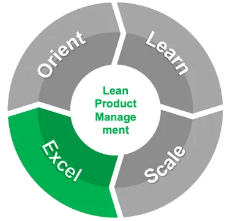

# Lean Product Management: Excel with Composability and Continuous Innovation

We have seen implementations of Lean Product Management at scale succeed in large and smaller enterprises using a four-phased iterative approach. This story dives deeper into the fourth phase: **Excel** with Composability and Continuous Innovation.

## Harness the full potential of compounding innovation at scale

As the enterprise gets good at producing portfolios of desirable and viable offerings, opportunities often arise to combine these offerings, frequently together with partner-provided offerings, in innovative ways to solve more complex, higher value customer problems. Such composite solutions can themselves be productized, for example as “bundled” offerings, helping businesses pull away from competitors unable to offer similar solutions. The composability of offerings so that they can be used as “building blocks” in composite solutions becomes a new concern.

With this new sophistication and a culture of continuous learning, experimentation, and improvement, the enterprise has completed its transformation journey and is on its way to excelling in the performance of its mission and responsibilities — ideally leveraging all of the exponential accelerators discussed in previous stories to expand the success of its Lean Portfolio Management initiative, add fuel to the fires of compounding innovation, and further accelerate exponential returns on investment.

## Excel at enterprise-scale innovation via Product Line Management

Most consumers are willing to pay a lot more for a car than for the parts needed to assemble a car. That’s because a car provides a lot more value — it includes not only the parts but also the assembly and testing, which most of us lack the skill, time, and equipment to do safely. Demand meets supply at a price point with a value surplus attractive enough for both consumers and car manufacturers to exchange money for cars, not DIY-car-kits.

Complex enterprises offering many products leave value on the table when they fail to exploit opportunities to combine their products together with partner offerings to solve higher value problems. However, silo’ed organizations can render such product “bundling” at an attractive price point unfeasible. Time to implement Product Line Management, the ultimate Lean Product Management silo buster.

An enterprise’s Product Line Management System (PLM) is the Operational Value Stream in which leaders make decisions about the enterprise’s products so as to deliver value to the enterprise’s stakeholders — customers, owners / shareholders, employees, partners, communities, governments, etc. PLM coordinates decisions within and across the enterprise’s Product Lines, each of which has responsibility for one or more product portfolios.

The PLM process owner is usually the Chief Product Officer or Chief Innovation Officer of the enterprise. Product Line owners are often General Managers with Profit & Loss (P&L) responsibility. An enterprise’s Product Lines may be highly visible to the public — for example, many large public enterprises report their financial performance by Product Line.

The Chief Product / Innovation Officer (CPO / CIO) works with staff and the leadership team to establish the **Decision Context** that will be relevant in the strategic decisions leadership will make, provides **Decision Support** to help the leadership make specific decisions, and provides **Decision Assurance** to help the enterprise follow through on those decisions.

## Establish the Decision Context relevant to most strategic decisions

The CPO / CIO develops the Enterprise Product Strategy, which describes how the enterprise will achieve its strategic product goals and transition from its As-is to its To-be Enterprise Product Architecture. The Board of Directors or other enterprise governing body may review and approve an updated enterprise strategy annually, and the CPO / CIO will need to defend the Enterprise Product Strategy in that context.

The CPO / CIO is the process owner for Lean Product Management and typically has management responsibility for the Research & Development function. It follows that the Enterprise Product Strategy addresses the end-to-end scope of Lean Product Management, includes the Research & Development function in its entirety, and interlocks with strategies developed by the enterprise’s other functional leaders — Marketing & Sales, Production & Support, People, Finance, Technology, etc.

The Enterprise Product Architecture is constrained by the overall Enterprise Architecture. Both should address Business Architecture including relevant Operating Models, Business Processes, Organizations, and Locations, as well as Technology Architecture including relevant Applications, Data, and Infrastructure.

In an enterprise with a Holding Company Operating Model, the CPO / CIO may act as the operational CPO / CIO for multiple subsidiaries, devoting a fraction of their time to each. In an Operating Company, the CPO / CIO has a considerable opportunity to shape much of the overall Enterprise Architecture because Lean Portfolio Management becomes the beating heart of the enterprise’s management system as it matures.

In doing so, it’s wise for CPO / CIO’s to remember Conway’s Law — systems match the hierarchical structure of the organizations that design them. This is a brilliant insight that leads directly to the notion of Composable Businesses, described in [Gartner’s 2020 Symposium keynote](https://www.gartner.com/smarterwithgartner/gartner-keynote-the-future-of-business-is-composable).

As Cloud / IaaS, PaaS, SaaS, and even Business-Process-as-a-Service (BPaaS) wash over the world, complex enterprises are increasingly “made from interchangeable building blocks”. Per Gartner this gives enterprises “more speed through discovery, greater agility through modularity, better leadership through orchestration, and resilience through autonomy.”

The Enterprise Product Architecture describes which As-is and To-be products (goods, services, and ideas) the enterprise produces, how it produces them, and the rationale justifying these choices. [Wardley Maps](https://learnwardleymapping.com/) are an insightful way to describe how composable products are assembled because they illustrate dependencies among products at different evolutionary stages and facilitate productive strategy discussions.

Other frameworks worth considering in shaping the Enterprise Product Architecture include [APQC’s process classification framework](https://www.apqc.org/process-frameworks) to help organize business functions and associated value streams, as well as [TBMC’s Technology Business Management Discipline](https://www.tbmcouncil.org/learn-tbm/what-is-tbm/) and [The Open Group’s IT4IT Framework](https://www.opengroup.org/it4it) to help organize technology functions and associated value streams.

## Provide Decision Support to help leadership make specific decisions

Agile and resilient enterprises make strategic decisions continuously as circumstances change, opportunities knock, and threats arise. Annual board-approved product strategies serve only to establish a new baseline for further change management throughout the fiscal year which the Product Line Management System facilitates. It must be so, because enterprises must continuously “Innovate or Die”.

Leaders can’t wait a year to invest — they must act on new information when they get it. That said, the money to invest has to come from somewhere. Often product investments must be reallocated based on new priorities, justified by new expectations of product value (customer satisfaction vs alternative options, sales, revenues, profits, costs, etc.).

The politics of this, already fraught, are further complicated by composable products with complex interdependencies. How should profits and costs be allocated to products that are sold both independently and also as part of several other composable products? What about platforms that aren’t sold independently but support all the other product lines, and so are cost centers not profit centers?

What a nightmare! A Product Investment Review Board (IRB) is the way to for CPO / CIOs to save their careers from a political train wreck. The IRB meets weekly or fortnightly to review strategic opportunities and threats and make investment decisions accordingly. Since these decisions may materially impact functional leaders’ performance (and compensation), it should be chaired by the CEO or someone who has management authority over all impacted leaders.

The IRB should deep dive into each Product Line at least once per quarter, weighing whether to increase, decrease, or maintain investments against strategic opportunities and threats. CPO / CIOs and their staff should help Product Line leaders prepare Lean Business Cases that support these IRB investment decisions.

Lean Business Cases should be prepared in short and long term planning horizons (e.g., [Three Horizons of Growth framework](https://www.mckinsey.com/capabilities/strategy-and-corporate-finance/our-insights/enduring-ideas-the-three-horizons-of-growth)) for scenarios including (1) maintaining existing investment levels, (2) if relevant, increasing investment to seize opportunities and/or mitigate threats, and (3) reducing investment (usually prepared only when ordered to do so by the IRB to reallocate investments or reduce overall enterprise expenses).

CPO / CIOs should ensure that Lean Business Cases are reviewed in advance by other Product Line and Functional leaders to identify risks, issues, and opportunities. These should be shared with the IRB during its deep dive into the Product Line and its Lean Business Cases. I have found a HUGE benefit of doing this is it nudges the leaders to have the hard discussions about internal risks / dirty laundry (e.g., poor Security hygiene) BEFORE it gets aired out in front of the CEO.

## Provide Decision Assurance to help the enterprise follow through

The Product IRB’s Decisions and Actions, together with materials presented to the IRB, should be published and maintained in a PLM Repository and shared as widely as possible, though much of the information is competition sensitive and can only be shared among a few leaders.

Decisions without follow through are like the proverbial tree falling in a forest with no one around to hear — it may make a noise, but doesn’t matter. CPO / CIOs and their staff must provide Decision Assurance to help the enterprise’s leaders follow through, lest the IRB becomes a Paper Tiger.

When it is done in the spirit of helping all leaders succeed — a spirit of “insight not oversight” — an IRB with teeth can help promote a healthy competition among the leadership and their teams. Who has the clearest business case? The best security hygiene? The most support from partners? Mid-level managers responsible for these things in each Product Line may come to appreciate an IRB with teeth because it can help them get the attention and resources they need from their busy Product Line leaders.

The Product IRB is also the decision authority for material changes to the Enterprise Product Architecture, including the Lean Product Management process and its supporting systems. Given its nature, Lean Product Management spans all the enterprise functions and by extension all enterprise support systems such as ERP (SAP, OBS, etc.), HCM (Workday, OPS, etc.), Sales (e.g., SalesForce) and so on.

The CPO / CIO is thus the owner of Product Master Data Management — when the IRB decides to make material changes to the enterprise Product Catalog / Taxonomy, the CPO / CIO coordinates with relevant system owners to ensure those changes are swiftly propagated.

## Prioritize investments in accelerators yielding exponential benefits

Lastly, and perhaps most importantly, the Product IRB is the decision authority for investing in AI-powered accelerators that generate exponentially better products, services, financials, and inspiration. These include not only compounding innovation — which Lean Product Management itself ignites at scale — but also network effects, viral ideation, agile team-of-teams learning, and artificial intelligence itself.

And so we have come full circle. In an earlier story we wrote that each exponential accelerator is a technique, grounded in mathematics, that translates *linear* changes in production inputs into *exponential* changes in outputs and/or outcomes, as expressed in a transformation equation which serves as its mathematical basis.

Since many techniques are capable of producing linear benefits as inputs change, but precious few produce exponential benefits, the CPO / CIO and Product IRB would be wise to consider prioritizing investments in exponential accelerators over other investments.

In this series on Implementing Lean Product Management at Scale, we explored how to solve the challenge of activating at scale the feedback loop between the producers of innovation and their customers, in order to unlock exponential returns on investment due to compounding innovation.

We will explore how to unlock the at-scale benefits of the remaining exponential accelerators in future stories.