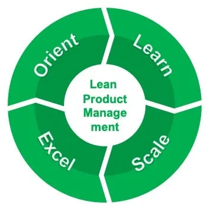

# Implementing Lean Product Management at Scale

This story dives deeper into Lean Product Management, as promised at the end of our earlier story on Compounding Innovation.

All enterprises must “innovate or die”, and so they MUST implement effective Product Management at scale, whether they call it that or not. Service providers and other enterprises with lower margins and/or differences in the nature of innovation are usually better off implementing and scaling Lean Product Management.

In our experience, this is MUCH easier said than done. Fundamentally, it requires the enterprise’s culture to change itself. Appointing a Chief Product / Innovation Officer and/or retaining a product consultant is only the beginning of a long, but in the end worthwhile, transformation journey.

There are many ways to go about this transformation. We have seen it succeed in large and smaller enterprises using a four-phased iterative approach, shown in the graphic above and described below.

## 1. Orient your leaders (“Customer-Centric Product Orientation”)

Transformation takes leadership. One leader can spark change, but it takes a sustained commitment from the entire leadership team to transform an enterprise’s culture. Winning the hearts and minds of the leadership team is critical for success at scale.

Of course the leadership team isn’t idly waiting for more work to do in their spare time — they must be sold on the value proposition for their customers, shareholders, employees, partners, and other stakeholders. Leaders worth their salt will be skeptical of talk — they’ll want to see proof of the value potential in their own organizations.

Customer-centricity is key — Lean Product Management must sustainably make the organization’s offerings more desirable, increasing customer lifetime value, profitability, and other benefits.

## 2. Learn with one product (“Bottom-Up Approach”)

“Prove it” may be the first thing you’ll hear from skeptical leaders already working long hours when you suggest implementing Lean Product Management has a strong value proposition. In fact, you’ll be lucky if that’s what you hear — you’re just as likely to hear “thanks but no thanks”.

Better stop theorizing, roll up your sleeves, and get your hands dirty. Find innovation the enterprise is already doing to solve individual customer problems (it’s either happening or you’re not getting repeat customers). Validate a few other customers desire that same innovation. Make relevant leaders aware of that innovation’s viability. Then, get the investment needed to productize it and sell it across the addressable market.

## 3. Scale learnings across the portfolio (“Top-Down Approach”)

Early, tangible successes with Lean Product Management will begin to open the hearts and minds of skeptical leaders as they learn first-hand about its value potential. You’ll know you’re ready to begin scaling the initial learnings across the organization’s offering portfolio when the leadership team stops resisting your “help” and starts asking for it.

Opportunities will begin arising to establish offering portfolios, inventory their offerings, simplify and rationalize them, standardize, modernize, and then move them into continuous optimization. As you succeed, silo’ed business functions will evolve into value streams that accelerate the flow of innovation value to customers and amplify customer feedback loops.

It’s easy to take your eyes off the ball and get caught up in process when taking a “Top-Down Approach” — or at least to create that perception among the leadership team. Best to avoid jargon and to over-communicate the pragmatic value of everything you ask them to do — or else you’ll start losing their support and the transformation will languish.

## 4. Excel with composability and continuous improvement

As the enterprise gets good at producing portfolios of desirable and viable offerings, opportunities often arise to combine these offerings, often together with partner-provided offerings, in innovative ways to solve more complex, higher value customer problems. Such composite solutions can themselves be productized, for example as “bundled” offerings, helping businesses pull away from competitors unable to offer similar solutions. The composability of offerings so that they can be used as “building blocks” in composite solutions becomes a new concern.

With this new sophistication and a culture of continuous learning, experimentation, and improvement, the enterprise has completed its transformation journey and is on its way to excelling in the performance of its mission and responsibilities — ideally leveraging all of the exponential accelerators discussed in previous stories to expand the success of its Lean Portfolio Management initiative, add fuel to the fires of compounding innovation, and further accelerate exponential returns on investment.

We elaborate on each of the above phases in other stories.