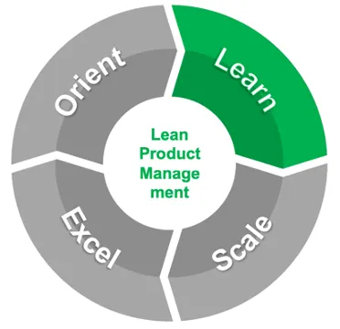
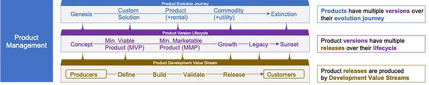

# Lean Product Management: Learn with one Product

We have seen implementations of Lean Product Management at scale succeed in large and smaller enterprises using a four-phased iterative approach. This story dives deeper into the second phase: **Learn** with one Product (a “Bottom-Up” Approach).

## Focus on creating immediate and expanding value

“Prove it” may be the first thing you’ll hear from skeptical leaders already working long hours when you suggest implementing Lean Product Management has a strong value proposition. In fact, you’ll be lucky if that’s what you hear — you’re just as likely to hear “thanks but no thanks”.

Better stop theorizing, roll up your sleeves, and get your hands dirty. Find innovation the enterprise is already doing to solve individual customer problems (it’s either happening or you’re not getting repeat customers). Validate a few other customers desire that same innovation. Make relevant leaders aware of that innovation’s viability. Then, get the investment needed to productize it and sell it across the addressable market.

## Don’t get distracted by jargon and complexity!

Rinse and repeat! This is the essence of Lean Product Management. It’s SO important to keep it SIMPLE. Yes, as the enterprise learns with its first product, Lean Product Management will get more sophisticated. Some true believers are tempted to dive right into all the jargon and complexity from the outset. RESIST! FOCUS on creating immediate and expanding value from the innovation for customers and for the enterprise. EVERYTHING ELSE must support — and be subordinate — to that purpose.

Perhaps you can read in this author’s voice the scars that led to my conviction about this. Consider the wisdom of the adages “success breeds success” and “perception is reality”. Early success — *actual **and perceived*** — with the first few products will win the hearts and minds of the leadership team, which is critical for Lean Product Management success at scale. Even if the first product actually succeeds, jargon and complexity will clutter leadership’s perception, and they may conclude the early success came at too great a cost to scale across the enterprise.

## Coordinate continuous innovation as the product evolves

All that being said, while carefully managing the leadership team’s perception at all times, things will need to get more sophisticated. Innovation doesn’t stand still, and continuous innovation does need coordination. While one innovation is being deployed, the next is being conceptualized. It gets messy as the innovations scale to many customers.

Versioning is an approach that can help as it is easily understood. You can say “after testing with some initial customers, we’re taking version 1 of our new product to market” and most people will get it. Marketing may step in and say “we can’t call it version 1, no one will buy it” — and that’s fine, call it version 2024 or something, but everyone still gets that it’s the first version. What’s nice is they’ll also understand future versions if the product succeeds, and they’ll get that a new version is in development while the current version is generally available.

In fact, successful products will likely have many versions throughout their **Product Evolution Journeys** from **Genesis** to **Extinction**. Simon Wardley has done some wonderful work on product evolution in his [“Wardley Mapping” methodology](https://learnwardleymapping.com/) — it can help answer questions leaders may have even in the early days of the transformation about how products will evolve. I’ll revisit Wardley Maps in a future story about the Excel phase.

## Continuously innovate throughout a product version’s lifecycle

Even one version of a product doesn’t stand still — innovation continues throughout its **Product Version Lifecycle** from **Concept** to **Sunset**. Things can get confusing. What does it mean when Version 1 of a product has multiple versions? Importantly, many leaders and other people in the enterprise may not need to know much about how one version of a particular product matures.

For those that do need to know, we find it helpful to say that Version 1 will have multiple releases as it matures, rather than multiple versions. As justification, we can point to many consumer software products that have Alpha and Beta releases for upcoming versions of their software before its General Availability release, though not all products require that level of sophistication in their early releases.

Every product that serves many customers starts with a **Concept**. It’s wise to invest the minimum necessary to test the product version’s viability with early adopters using a **Minimum Viable Product** release. Once proven viable, it’s also wise to begin making the product version available to the addressable market quickly via a **Minimum Marketable Product** release.

From that point, future releases will aid the product version’s **Growth** in value for customers and the enterprise until it inevitably begins declining, ideally as it is replaced by the next version of the product. Further releases help the enterprise support the product version’s **Legacy** customers until the enterprise decides to **Sunset** its support for that version.

While some product releases are simple enough for one person to produce, many are produced by teams who perform Define, **Build**, **Test**, and **Release** functions organized in one or more **Development Value Streams** that continuously deliver innovation to customers as the product evolves.

## Maximize desirability and viability with configurable products

Aside from consumer goods such as groceries, it’s rare for a product to be both desirable and viable right out of the box. Most car sellers for example offer a base model common to all customers, and add-ons that appeal only to certain customers willing to pay a bit more.

When we say the car model being sold to customers this year is offered in multiple configurations, “model” refers to the manufacturer’s product, “this year” refers to the product version, and “being sold to customers” refers to the general availability release. This example illustrates that a product release can, and often does, have multiple configurations.

Many Software-as-a-Service (SaaS) providers offer their products in a Freemium business model, where basic features are offered for free or at a reduced price, and advanced features at a higher price. Such models may include Trial, Bronze, Silver, and Gold product configurations as a way of attracting new customers and then enticing them with more value as they gain experience with the basic features. Another twist on this is “T-Shirt sizes” — Small, Medium, Large, etc. You get the idea.

Software itself can be offered in an as-a-service configuration (e.g., SaaS) and/or as licensed software configured more like a “good” than a service. As a reminder, a product can be a good, a service, an idea, or some combination — these are all ways to configure a product.

Executives from Fortune 500 IT service providers have said to this author “we’re a services company, not a product company”. It follows that product management in many IT services companies is immature.

Yet even IT services companies today have offering configurations that depend on the degree of automation, ranging from Consulting Services which have minimal automation, Professional Services such as software development which depend on automated tool chains, Managed Services which operate technologies within service level agreements, and Cloud / XaaS Services which are fully automated.