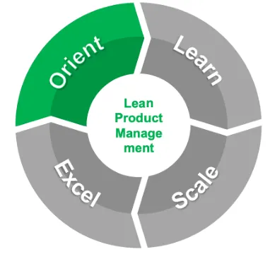
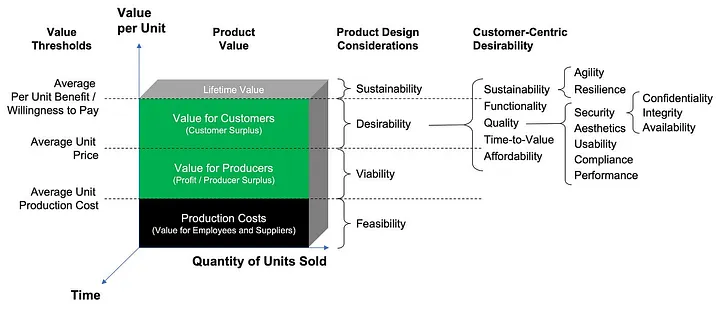

# Lean Product Management: Orient Enterprise Leaders

We have seen implementations of Lean Product Management at scale succeed in large and smaller enterprises using a four-phased iterative approach. This story dives deeper into the first phase: Orient Enterprise Leaders.

## Orienting the leadership to begin the journey

Initially, orienting the enterprise’s leadership team means the often very difficult task of winning their buy in for starting the journey to implement Lean Product Management at scale.

Transformation takes leadership. One leader can spark change, but it takes a sustained commitment from the entire leadership team to transform an enterprise’s culture. Winning — and keeping — the hearts and minds of the leadership team is critical for success at scale.

Of course the leadership team isn’t idly waiting for more work to do in their spare time — they must be sold on the value proposition for their customers, shareholders, employees, partners, and other stakeholders. Leaders worth their salt will be skeptical of talk — they’ll want to see proof of the value potential in their own organizations.

## Arriving at a customer-centric product orientation

Customer-centricity is key — Lean Product Management must sustainably make the organization’s offerings more desirable, increasing customer lifetime value, profitability, and other benefits.

If — and only if — the implementation journey begins to succeed in the eyes of leadership, orienting the leadership team will come to mean re-focusing their decisions on maximizing the customer lifetime value and profitability of the enterprise’s offering portfolio. Leadership will have a new customer-centric product orientation.

Such an orientation for decision making focuses — as shown in the above graphic — on product value and also product design considerations, especially customer desirability.

## Understanding Product Value

Building on some excellent research published by the Kellogg School of Management, the Customer Lifetime Value of a product can be thought of as the volume of a cube with three dimensions. As a reminder, a product can be a good, a service, an idea, or some combination of these.

For a given product (or product portfolio), the height of the cube is the average total per-unit benefit, which is what customers are willing to pay for one unit of product on average. The depth of the cube is the “customer lifetime”, which is the total time in which the product was sold or procured. The width of the cube is the average quantity of units sold or procured in one time period.

Horizontal slices of the cube stacked atop one another represent value for particular stakeholders. The volume of the bottom slice represents the product’s Lifetime Production Cost, which is the total cost of producing the product over its customer lifetime. Since these costs are paid by the enterprise to its employees and/or suppliers, this slice represents the value of the product retained by these stakeholders.

The volume of the middle slice represents the product’s Lifetime Profit or Producer Surplus. Its height is bounded on the top by the average Unit Price, and on the bottom by the average Unit Production Cost. Since this slice includes customer payments (e.g., revenues) minus costs it represents the value of the product retained by its producer.

The volume of the topmost slice represents the product’s Lifetime Customer Surplus. Since this slice is the difference between what customers pay for the product and what they are willing to pay, it represents the value of the product retained by its customers.

When an enterprise’s leaders understand how their decisions ultimately impact the value of its product portfolio for itself and for its customers and stakeholders, Lean Product Management graduates from a theoretical exercise to the beating heart of the enterprise’s management system.

## Understanding Product Design Considerations

The components of a product’s value relate directly to its design considerations. As described in the [“Solution” article published by the Scaled Agile Framework](https://scaledagileframework.com/solution/), a solution (product) has four fundamental properties: Desirability, Viability, Feasibility, and Sustainability.

In a customer-centric product orientation, the most important of these is desirability. If the product isn’t **desirable**, no customers are willing to pay anything for it, which means there is also no value for the producer or its employees and suppliers. On the other hand if the product is very desirable, customers will be more than willing to pay a fair price and then some, which means they retain a surplus of customer value.

Of course, for a producer to want to offer its product to customers, the product must be **viable**, which means that the producer is able to retain substantially more value from the product than it cost to produce. Viability implies that producing the product at a reasonable cost is in fact **feasible**. Viability also implies that both customer demand and costs of production are **sustainable** over the product’s customer lifetime.

A product’s desirability includes its features / functions, its “triple constraint” of cost / affordability, time-to-value, and quality, and also its sustainability / durability over time. Quality includes characteristics such as aesthetics, usability, performance, security (confidentiality, integrity, and availability), and compliance. Sustainability / durability includes a product’s agility / adaptability and resilience.

Unless enterprise leaders understand how their decisions affect their product portfolio’s design characteristics, they won’t be able to understand how their decisions impact the value of its product portfolio.