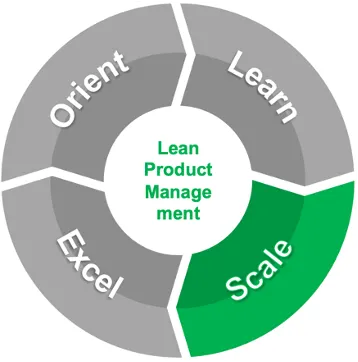
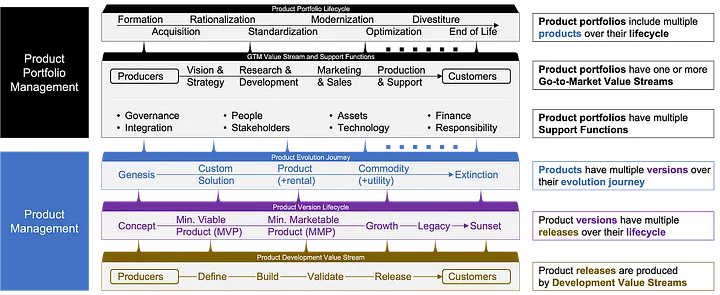

# Lean Product Management: Scale Learnings Across the Portfolio

We have seen implementations of Lean Product Management at scale succeed in large and smaller enterprises using a four-phased iterative approach. This story dives deeper into the third phase: **Scale** learnings across the portfolio (a “Top-Down” Approach).

## Remain focused on value — don’t get caught up in process!

Remain focused on value — don’t get caught up in process!

Early, tangible successes with Lean Product Management will begin to open the hearts and minds of skeptical leaders as they learn first-hand about its value potential. You’ll know you’re ready to begin scaling the initial learnings across the organization’s offering portfolio when the leadership team stops resisting your “help” and starts asking for it.

Opportunities will begin arising to establish offering portfolios, inventory their offerings, simplify and rationalize them, standardize, modernize, and then move them into continuous optimization. As you succeed, silo’ed business functions will evolve into value streams that accelerate the flow of innovation value to customers and amplify customer feedback loops.

It’s easy to take your eyes off the ball and get caught up in process when taking a “Top-Down Approach” — or at least to create that perception among the leadership team. Best to avoid jargon and to over-communicate the pragmatic value of everything you ask them to do — or else you’ll start losing their support and the transformation will languish.

## Scale innovation flow and feedback in value streams across silos

As we scale Lean Product Management, it’s important to remain oriented at all times on WHY we are doing this in the first place. Lean Product Management isn’t an end unto itself — it’s the solution to the challenge of activating at scale the feedback loop between the producers of innovation and their customers, in order to unlock exponential returns on investment due to compounding innovation.

In order to realize the compounding benefits of innovation, its producers must continuously flow value to, and amplify and respond to the feedback they receive from, their customers. This virtuous cycle of innovation flow and feedback is what ignites compounding benefits, ultimately yielding exponential returns.

Silo’ed business functions are like kinks in a garden hose — at best, innovation just trickles out. Those nearest the customer may do their best to innovate on their own, but customers expect providers to bring innovation that taps into the knowledge and experience of their entire enterprise ecosystem. Innovation flow and feedback must be systematized across the functional silo’s, else the enterprise can’t innovate at scale. Remember, enterprises must “Innovate or Die”.

## Systematize innovation across Operational Value Streams

The Development Value Streams across Define, Build, Test, and Release functions we organized in [Phase 2 of our Lean Product Management journey](./Learn_with_one_Product.md) are necessary but not sufficient. We must go further and organize Operational Value Streams across the enterprise’s remaining functions.

Development, part of “Research & Development”, is an important function in a larger “Go-to-Market” Operational Value Stream that starts with Vision & Strategy, flows through Research & Development and Marketing & Sales, and ends with Production & Support.

Systematizing innovation flow and feedback across the Go-to-Market value stream takes a lot more than applying a new label to a group of silo’ed functions. The work and incentives assigned to everyone in these functions must all have the same Customer-Centric Product Orientation we first encountered in [Phase 1 of our Lean Product Management journey](./Orient_Enterprise_Leaders.md).

Everyone in the value stream must have a focus on the same set of related product offerings grouped into a portfolio. Vision & Strategy sets the strategy for the portfolio, Research & Development generates innovations aligned with the portfolio strategy, Marketing & Sales helps customers across the addressable market gain access to the portfolio’s innovations, and Production & Support helps the enterprise and its customers and stakeholders derive value from these innovations.

In DevOps, developers don’t throw software over the wall at the operations team who must then deal with inevitable production headaches on their own, they instead work closely together with operations at every step of development and production. Just as everyone in the Development Value Stream must adopt DevOps practices in order to maximize flow and amplify feedback loops, everyone in the Go-to-Market Operational Value Stream must adopt X-Ops practices, which extend DevOps practices beyond development to the remaining business functions.

The same goes for the rest of the Operational Value Streams that support Go-to-Market, such as Governance, Integration, People, Stakeholders, Assets, Technology, Finance, and Responsibility. Each of these involves a set of normally silo’ed business functions — for example “Hire to Retire” in the People Operational Value Stream — in which everyone involved must have a Customer-Centric Product Orientation, focus on a portfolio of product offerings, and adopt X-Ops practices.

## Continuously innovate throughout the product portfolio lifecycle

By now it should be clear that systematizing Go-to-Market and supporting Operational Value Streams around a product portfolio isn’t something that can or should be done “under the radar”.

This undertaking involves functional management at all levels, takes a material amount of time and investment, and is highly visible to the enterprise’s leadership team. Leadership will want to understand the business performance of the product portfolio they have invested in.

The portfolio may very well become a profit center led by an executive with P&L responsibility. Whether or not this occurs, the product portfolio from its **Formation** becomes an “enterprise within an enterprise”, and like all enterprises begins to take action to increase its value both organically and inorganically.

Inorganic actions may include the **Acquisition** of new products through organizational restructuring, partnerships, and business mergers and acquisitions, and also the **Divestiture** of products from the portfolio through organizational restructuring and business divestitures.

Organic actions tend to follow a sequence that begins with Portfolio **Rationalization**, which ensures the entire portfolio “makes sense” according to some cumulative logic, combines redundant products, and begins to sunset products that are no longer “fit”.

The products that remain undergo **Standardization**, which ensures the portfolio’s customers, employees, and other stakeholders understand what they need to about the products in the portfolio and their cumulative logic. Examples may include establishing basic and advanced configurations for all products in the portfolio, adding new information about the portfolio to the enterprise’s web site, training the portfolio sales team on new “Sales Kits” to increase sales effectiveness, and training the production team on enhanced Run Books in new “Delivery Kits”.

Some of the products in the portfolio may need to undergo **Modernization** in order to take advantage of newer methods and technologies that will make the products more desirable and extend their viability. All of the products will eventually enter into **Optimization** where continuous innovation will flow throughout each product’s evolution journey.

Organic and inorganic actions are taken continuously from the portfolio’s formation until its **End of Life**, which occurs either because all of its products have gone extinct, or the portfolio is merged into another.