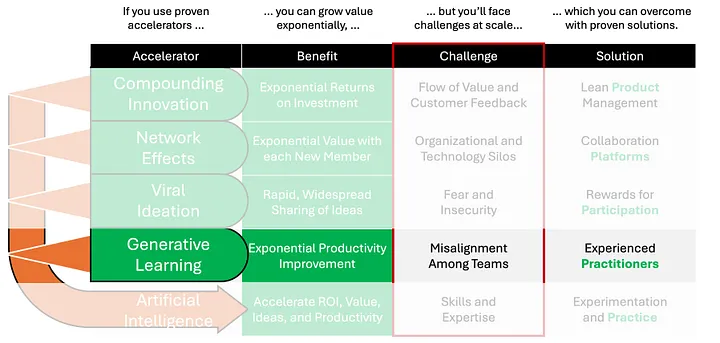

# Generative Learning

If you have a pulse, it races when you marvel at a well-trained team doing things you didn’t think human beings could do. Whether it’s the Red Bull team completing a pit stop in 2.10 seconds flat, the Chiefs winning the super bowl for the 2nd straight year, or the Hawkeyes’ relentless march to the NCAA women’s championships, well-trained teams *inspire* us to *aspire*.

While individual prowess plays an important role in teams, even the best individual players are no match against well-trained teams. Teams outperform individuals because they have mastered not only individual skills, but also how to use their skills collectively to accomplish their shared goals.

With teams as with individuals, the more you learn the better you get — and the faster you learn the faster you get better. The best teams outperform other teams because they learn more faster — exponentially faster.

OpenAI’s ChatGPT4 AI summarized agile team-of-teams learning in this way:
- **Rationale**: Enhances speed, flexibility, and collaboration, optimizing the software development lifecycle, reducing time-to-market, and enabling rapid adaptations to market needs.
- **Mathematical Basis**: Conceptualized through principles of efficiency, optimization, and enhanced productivity, with improvements in one cycle serving as the base for the next, akin to iterative functions like \\(O_{n+1} = O_n + Δ\\).

The reason team learning is exponential is because it’s a form of compounding. Team productivity is a function of team knowledge / skill. When a team learns it acquires new knowledge which enhances its productivity. Each team learning cycle increases its productivity. Shorter learning cycles increases the rate of compounding, which accelerates productivity improvements exponentially.

Complex enterprises understand the benefit of agile teams but have struggled to scale those benefits. Often they have deployed many agile teams, but struggle to unlock exponential productivity improvements. The reason for this is, just as the best individuals are no match against well-trained teams, the best teams are no match against well-trained teams of teams. The challenge complex enterprises face is misalignment among all the agile teams they have deployed.

This is the challenge General Stanley McChrystal faced when in 2003 he led the Joint Special Operations Task Force in Iraq. In his book Team of Teams, Gen. McChrystal explained how coalition forces were failing against Al Qaeda in Iraq despite having an overwhelming force consisting of a vast numbers of military teams at their disposal. Before the coalition could plan and decide on a course of action, AQI’s fluid team of teams had already adapted and changed the circumstances.

McChrystal’s solution has since evolved into the Team of Teams framework which involves four key competencies which fuel individual, team, and hence organizational success, including Trust, Common Purpose, Shared Consciousness, and Empowered Execution. These competencies are much easier to gain in individual agile teams and small businesses than in complex enterprises, which require trained practitioners.

Many frameworks for implementing agile-at-scale have evolved in response to this challenge. [Nimble has identified 6 such frameworks](https://www.nimblework.com/blog/scaled-agile-frameworks/) including the Scaled Agile Framework (SAFe), Scrum of Scrums (SoS), Large Scale Scrum (LeSS), Nexus, Disciplined Agile (DA), and Enterprise Kanban. [The Spotify Engineering Model](https://www.youtube.com/watch?v=Yvfz4HGtoPc) is also often used as a model for agile-at-scale.

Of these, this author’s personal favorite is the [Scaled Agile Framework (SAFe)](https://scaledagileframework.com/) because it is widely deployed, its methodology is free to read and use, millions have been trained in the various SAFe roles, its comprehensive, and it is continually evolving using its own methodology.

Regardless of the framework used, it’s important not to get caught up in all the jargon or try to use all of it just for the sake of using it. The important thing is to train practitioners on how to align the activities across agile teams so that they become a team-of-teams, unlocking exponential productivity improvements not just for individual teams but also for the entire enterprise.
