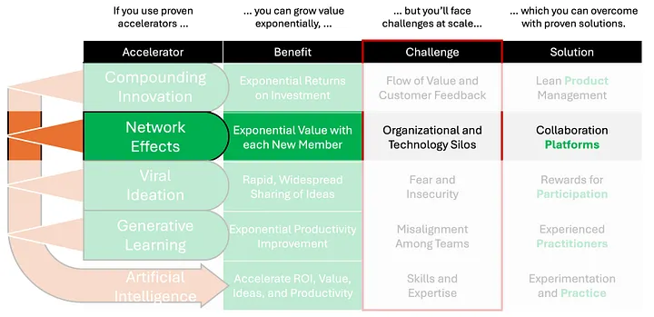
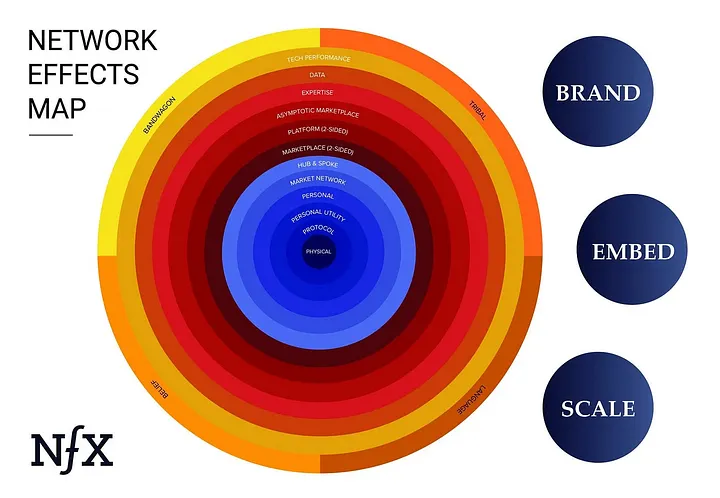

# Network Effects

If you use the popular professional networking site LinkedIn, you understand the value of network effects. Why aren’t there other professional networking sites? Because it’s so hard for another provider to create value sufficient to entice a critical mass of professionals to switch to their site. Why? Because everyone is already on LinkedIn.

OpenAI ChatGPT4’s AI summarized network effects in this way:
- **Rationale**: Increases in users or participants in a network increase the value of the network for each user, promoting user acquisition and engagement.
- **Mathematical Basis**: Metcalfe’s Law, represented by the value (V) of a network being proportional to the square of the number of connected users (n), or \\(V \propto n²\\).

Network effects are everywhere. Consumers use Amazon because it allows them to easily buy nearly every consumer item that can be supplied. Consumers use Facebook because most of their friends and family members also use Facebook. Businesses use Microsoft Office365 because they can easily share documents with other businesses who also use Microsoft Office365.

Enterprises who successfully create and leverage network effects across their customer, employee, and/or partner ecosystems enjoy competitive advantage because they are creating exponential value for each participant in their networks. This in turn has the potential to generate exponentially better products, services, financial returns, and inspiration.

Enterprises have many options for generating network effects at scale. According to [The Network Effects Manual on nfx.com](https://www.nfx.com/post/network-effects-manual), there are 16 kinds of network effects, summarized in the Network Effects Map shown below.

Because the value of a network increases exponentially with each new participant, the network yields true competitive advantage when the number of participants gets very large. Assuming the network has an inherently attractive value proposition (e.g., easily share feedback and ideas for product enhancements that result in happier customers and employees), enterprises must break down technological and organizational silos so that the network can become very large.

Very large networks depend on technology platforms for communication among network participants. The easier it is to communicate with other participants, the stronger the network’s value proposition. Unfortunately complex enterprises often have organizational and technology silos that make it hard for potential network participants to communicate. This is true for various reasons including acquisitions, joint ventures, security and regulatory policies, etc.

Maximizing competitive advantage due to network effects requires enterprises to identify the most important networks they provide and/or depend on. Then, for each network use case, enterprises must select a single technology platform for communication and collaboration among network participants. Disjointed technology platforms result in multiple smaller networks which each have exponentially less value than one larger network would have.

We’ll dive deeper into technology platforms used to create network effects in subsequent stories.