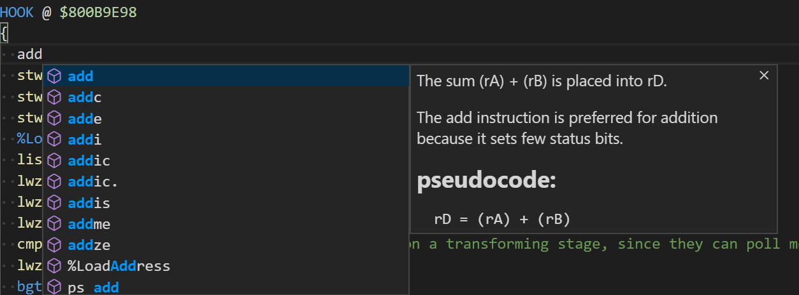
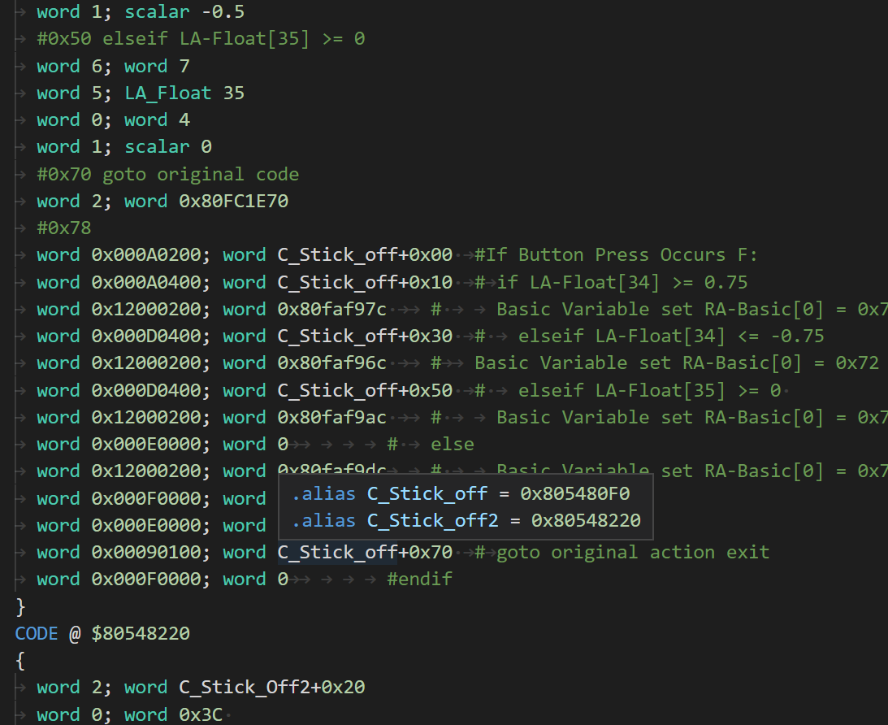

# GCTRM Editor

This project exists as a development tool to assist in the creation of assembly-based codes for ProjectM. One of the tools that exists that mod developers use is called GCTRealMate (GCTRM for short). This tool takes in a bunch of `.asm` files and spits out a binary blob of data called a GCT file. This is used in-turn by the gecko code handler to hook into offsets within a game and branch to custom code.

I noticed that creators of these files were using notepad without support for anything like syntax highlighting. This made them prone to making mistakes and likely caused many hours of bugfixing, poor documentation, and an inconsistent mix of tabs vs spaces.

To remedy this, I created this extension for Visual Studio Code that provides quality of life features that help make the creation of these codes much nicer. In doing so, I used a component of my old Spark project - [these opcode files](https://github.com/fudgepop01/spark/tree/master/src/resources/parseGCT/ASM_opcodes) - and added autocompletion, syntax highlighting, inline documentation, and more!

Builds On:
- [ProjectMCodes](./ProjectMCodes.md)
- [Spark](../2019/spark/spark.md)
- [Kaitai ide VSCode](../2019/kaitai_ide_vscode.md)

## Learnings

## Benefits

## Skills Learned/Applied

- Typescript
- VSCode Extension Development
- Reading a hardware architecture manual
- the concept of mnemonics
- interfacing with existing tools

## Repo Link

- repo: https://github.com/fudgepop01/GCTRM-Editor/
- [README](https://github.com/fudgepop01/GCTRM-Editor/blob/master/README.md)

- Gecko Codes
  - [Documentation about different Gecko "code types"](https://wiigeckocodes.github.io/codetypedocumentation.html)
  - [How they work](https://mariokartwii.com/showthread.php?tid=434)

## Screenshots

A demonstration of autocompletion and documentation:

Jump To Definition:

Semantic Autocompletion:

