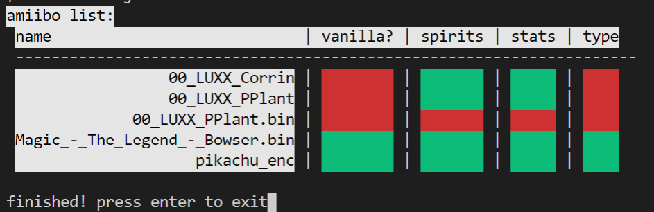

# Amiibo Validator

As I shared my findings with amiibox, I was noticed by a community that enjoys training their own amiibo and participating in user-led battles. I was invited to a group within the community and was assisted in research from those that were more technically inclined. With advancements in custom AI though, community members grew concerned that their more traditional amiibo training methods would become obsolete.

To mitigate this, I created an amiibo validator. It's a simple nodejs application that goes through, analyzes each amiibo file in a given folder, and prints out a table that will tell any event organizer about any modifications to said amiibo file.

Builds On:
- [amiibox](../2019/amiibox.md)

## Learnings

## Benefits

## Skills Learned/Applied

## Repo Link

https://github.com/fudgepop01/amiibo-validator

## Screenshots

