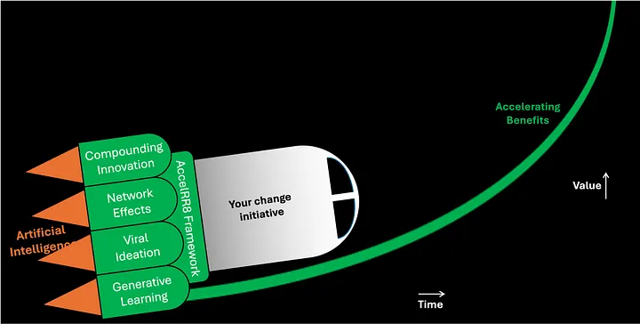

# Rocket to your aspirations using the AccelRR8 Framework

The AccelRR8 Framework is an actionable tool that helps enterprising leaders use proven accelerators to generate exponentially better products, services, financials, and inspiration.

We imagine the AccelRR8 Framework as an engine leaders can use to rocket to their aspirations. A rocket applies a force to its payload while it burns, accelerating its velocity faster and faster, and lifting it exponentially higher and higher off the ground.

Like a rocket, the AccelRR8 Framework is packed with accelerators. Strap it to your change initiative and watch its velocity accelerate and its benefits climb exponentially higher.

For example, many leaders are trying to help their enterprises leverage Artificial Intelligence. The AccelRR8 Framework can help them go faster and achieve greater benefits when they harness its proven accelerators:

- Use **Compounding Innovation** to generate exponential returns on AI investments, and use **Lean Product Management** to drive the continuous flow of value to, and feedback from, AI customers and stakeholders that is needed to ignite and sustain compounding benefits
- Use **Network Effects** to form and grow AI communities that provide exponential value with each new member, and use **Collaboration Platforms** to scale these communities across organizational and technological silos to connect everyone who stands to benefit from AI
- Use **Viral Ideation** to share AI ideas across the entire ecosystem with exponential speed and reach, and **Reward Participation** in AI ideation to overcome the fear and insecurity network participants often experience when sharing their ideas with large communities
- Use **Generative Learning** to improve enterprise productivity exponentially, and **Train Practitioners** in the community on proven ways to align activity and learning across teams to avoid teams tripping all over one another
- And finally, use **Artificial Intelligence** itself to boost the effectiveness and benefit of all the above accelerators, and encourage everyone to **Experiment and Practice** with AI to increase the enterprise’s AI skills and expertise.

Artificial Intelligence is just one example of a change initiative the AccelRR8 Framework can boost like a rocket. It can similarly boost Digital Transformation, IT Modernization, Cloud Adoption, Cybersecurity, Product Development, and many other change initiatives.

It works because all the above accelerators are techniques that translate *linear* changes in production inputs into *exponential* changes in outputs and/or outcomes, expressed mathematically in transformation equations. Many techniques are capable of producing linear benefits as inputs change, but precious few produce ***exponential*** benefits.

We love to see enterprising leaders achieving aspirations exponentially higher than they thought possible. Strap a rocket to your aspirations with the AccelRR8 Framework and watch them soar!