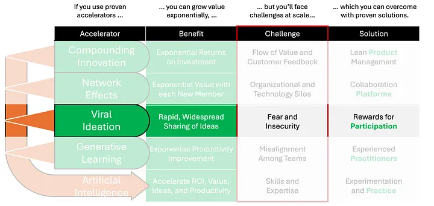

# Viral Ideation

Everyone in the world viscerally understands viral growth having just lived through the COVID-19 pandemic. We all watched in horror as the virus spread from one infected individual to millions all over the world in just a matter of weeks. This is because one infected person infected multiple people, who in turn infected multiple people and so on, causing exponential growth in the number of people infected.

While nobody wants viral diseases, we all (often, but not always) benefit when ideas spread virally throughout the networks to which we are connected. News of the pandemic spread faster than the disease itself, helping us to prepare for it. As they began to treat infected patients, the medical community shared their learnings with one another, ultimately improving patient outcomes.

OpenAI’s ChatGPT4 AI summarized viral ideation in this way:
- **Rationale**: Rapid and broad sharing among individuals through word of mouth and social networks, leading to user base expansion, enhanced brand awareness, and reduced customer acquisition costs.
- **Mathematical Basis**: Exponential growth models like \\(N(t) = N_0 \cdot e^{(r \cdot t)}\\), where a viral coefficient greater than one can lead to exponential user base growth.

Viral ideation depends on networks but is different than network effects. Whereas network effects create exponential value with each new participant over the long term, viral ideation creates exponential value in the short term because of the speed viral ideas propagate throughout the network. As such, viral ideation throughout a very large ecosystem of customers, employees, and partners has the potential to greatly accelerate learning, innovation, and financial returns.

[Josh Elman](https://medium.com/u/3fca1ea3f7bf) identified [The Five Types of Virality](https://joshelman.medium.com/the-five-types-of-virality-8ba42051928d), all of which are applicable to viral ideation. We’ve all experienced ideas that have gone viral through Word of Mouth (e.g., “Google It”), Invitations to Participate (e.g., LinkedIn), Fun to Share (e.g., Ice Bucket Challenge), and Demonstrations (e.g., Shared Pinterest Boards). These four types of virality work because the network participants are compelled to share their ideas.

The key challenge to viral ideation in complex enterprise ecosystems is fear and insecurity. After all, sharing ideas with your name attached to 100,000 or more professionals can be risky. What if it ends up being perceived as a bad idea? Livelihoods depend on good reputations.

Fear of sharing ideas is often due to a perception, fair or unfair, of the enterprise as having what [Westrum referred to](https://www.ncbi.nlm.nih.gov/pmc/articles/PMC1765804/pdf/v013p0ii22.pdf) as a Pathological or Bureaucratic culture, as shown in the table below. In such cultures, messengers are either shot or neglected, and bridging (across silos) is either discouraged or tolerated.

The solution for overcoming fear of sharing ideas is to reward network participants for sharing. This is the fifth type of virality: Incentivized Word-of-Mouth. Incentives need not be limited to monetary rewards, although that certainly helps. *Authentic* encouragement and recognition by managers and peers are also great incentives.

We’ll write more about rewards for sharing to encourage viral ideation in subsequent stories.