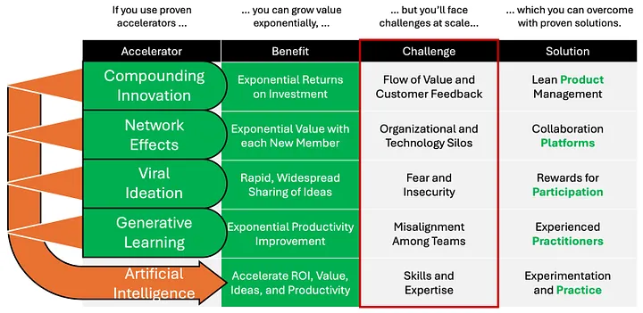

# Use the AccelRR8 Framework to Grow Value Exponentially

The AccelRR8 Framework is the conceptual foundation for the AccelRR8 Consortium Non-Profit. It is an actionable tool that helps IT Services leaders use proven methods to generate exponentially better products, services, financials, and inspiration in complex, large scale enterprises and ecosystems.

## Navigation

On desktop devices you will find the navigation menu to the left. This is the main way you'll
get around on this site, or by using special links.

On the right you'll find the different headings of an article. You can click one to instantly scroll
to that section.

On mobile (or if your screen is under 1000 pixels wide), there will be two menus icons on the top.
The one on the left will open the main navigation menu, and the one on the right will open the heading
navigation menu that lets you immediately jump to that respective part of the article.